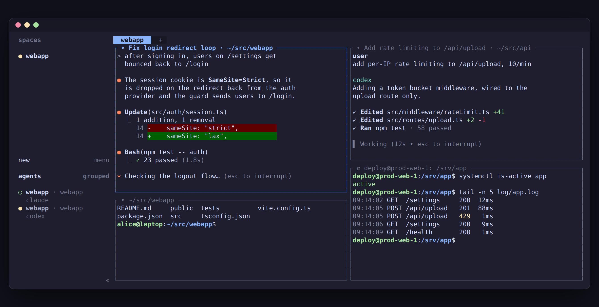

# pane-labels

A small [herdr](https://herdr.dev) plugin that puts three things in each pane's border:

- the pane's current directory
- the agent's session title, when an agent (Claude Code, Codex, ...) runs in the pane
- whether the pane is local `•` or inside ssh `⇄`



Tab names are left alone.

## Install

```sh
herdr plugin install macd2/herdr-pane-labels
```

The watcher starts with the herdr server. To start it right away without restarting herdr,
run `python3 watch.py` from the plugin directory.

A pane on its own in a tab has no border unless you turn borders on for every pane. Add this to `~/.config/herdr/config.toml`:

```toml
[ui]
pane_borders = "always"
```

Needs `bash`, `jq` and `python3`. Linux and macOS.

## How it works

`watch.py` subscribes to pane events on herdr's socket and runs `label.sh`, which reads
`herdr pane list`, `herdr agent list` and each pane's foreground process, then renames the
panes whose label changed. A pane counts as remote when its foreground process is `ssh`,
`mosh-client` or `autossh`. Starting ssh doesn't send a pane event, so the labels are also
refreshed every 5 seconds.

## Things to know

- Labels you set by hand get overwritten.
- Herdr draws labels as plain text and strips color codes, which is why local and ssh
  differ by symbol rather than color. Edit the two symbols in `label.sh` if you prefer
  others (emoji like 🔵 / 🟣 work too, but take two columns each).
- An agent running on the far side of ssh isn't detected. Locally the pane only runs `ssh`.
- While ssh is still connecting the label reads `⇄ ssh <host>`. It changes to the remote
  title once the remote shell sets one.

## Tests

```sh
tests/run.sh
```

Runs `label.sh` against recorded herdr output through a stub `herdr`.

## License

MIT
